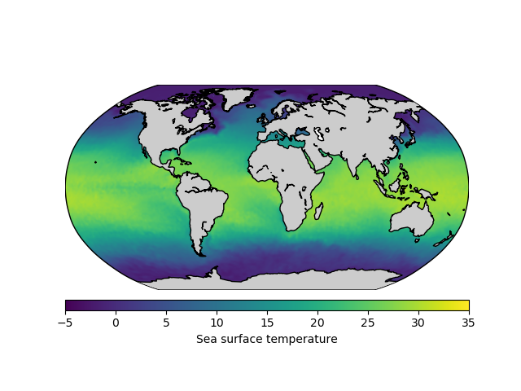

# WOA - Python
Reads WORLD OCEAN ATLAS 2018 (WOA18) variables and creates python numpy matrix with climatologies. Also extracts climatological information from a list of coordinate points.


## Getting Started
See the [World Ocean Atlas](https://www.nodc.noaa.gov/OC5/woa18/) for information on the available variables, resolution, etc.
To download all variables and resolutions, and convert to numpy arrays run the bash script:
```
./read_woa_all.sh
```
Uncomment those varaibles not of your interest.  
The compressed numpy files are saved to the output dir (default to woa_np), one file per variable.  
**WARNING**: The files at 0.25 degree resolution are quite large, aprox 1.5 Gb each for the temperature and salinity npz files.

**MONTHS** are given in a 0 to 11 scale

## Utilities
- `utils.py` contains utility functions to make global maps of specific variables and to extract data from vector of coordinate points
	 for example:
```
read_and_plot(
		variable='temperature',
	        resolution = '04',
        	woapath='woa_np/',
		month=0,		
		depthlevel=0,	
        	min_val=-5,
        	max_val=35,
        	title= 'Sea surface temperature',
        	filename='sst_jan.png')
```
would make the plot presented above
```
extract_woa(
        lons=[-10,-5],
        lats=[42,44], 
        depths=[0,20],
        months= [0,2],
        variable='temperature',
        resolution = '04',
        woapath='woa_np/')
```
would return 'array([14.12209034, 12.3142004 ])'  
this function extracts data from the specificied variable and resolution given lon and lat coordinates, if a depth vector is not provided it will extract the complete profile at each location, if a month vector is not provided it will extract the complete seasonal cycle.

- `extract_csv.py` is a python script to read coordinates and Month/Depth from a csv file, call extract_woa to extract the given variable at given resolution and save the extracted data into a csv file with the same filename (with suffix of the variable and resolution). For example:
```
python --variable "temperature" --resolution "1" --csv "csvs/csvdata.csv"
```
would write a csv file in csv/csvdata_temperature1.csv with the temperatures at 1 degree resolution for those coordinates, *note* that many locations close to coast would give no data.

When the csv does not have a column with "Month" the script would extract the data for the 12 months
```
python --variable "temperature" --resolution "1" --csv "csvs/csvdata_nomonth.csv"
```
would write file csv/csvdata_nomonth_temperature1.csv 

When the csv does not have a column with "Depth" the script would extract the data for all the depth levels
```
python --variable "temperature" --resolution "1" --csv "csvs/csvdata_nodepth.csv"
```
would write file csv/csvdata_nodepth_temperature1.csv 


## Other files not used
- read_woa_csv.py:  Reads the woa data from csv file format
- read_woa_iris.py: Uses iris and python-oceans packages to extract data from coordinates

## Prerequisites
[NetCDF4](https://unidata.github.io/netcdf4-python/netCDF4/index.html) python library, there is also an (unmaintained) read_woa_csv.py file where you can get ideas on how to read the data from csv files, without the need of NetCDF

## Authors
[Angel Lopez-Urrutia](https://lopezurrutia.github.com/)
This software is a contribution to project *Role of membrane DESaturases in the Global Ocean distribution of picoCYAnobacteria* (CYADES): RTI2018-100690-B-I00

## License
This project is licensed under the MIT License - see the [LICENSE.md](LICENSE.md) file for details

## Acknowledgments
 woa url formatting from [python-oceans](https://github.com/ocefpaf/python-oceans)

